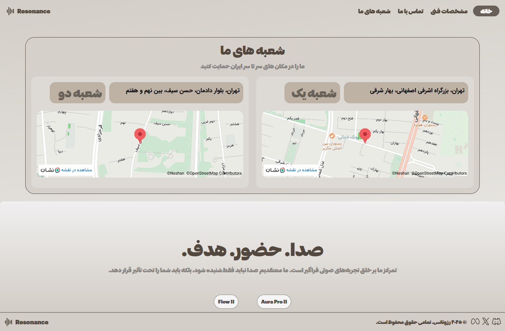
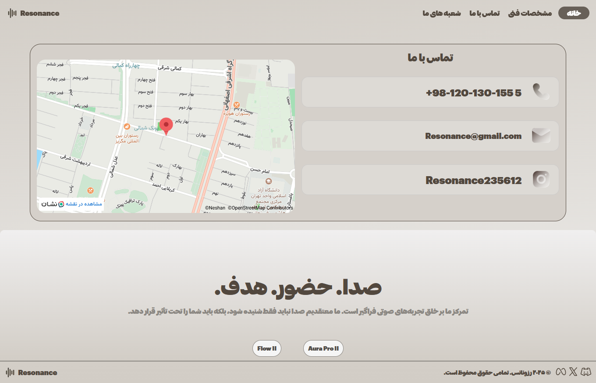

# Headphone-site
این وب‌سایت به‌عنوان یک Landing Page معرفی محصول هدفون طراحی و پیاده‌سازی شده است. تمرکز اصلی پروژه بر نمایش بصری قدرتمند محصول، انتقال حس کیفیت، سادگی و تجربه کاربری آرام و مدرن می‌باشد.
طراحی صفحه اول به‌صورت مینیمال و محصول‌محور انجام شده و با استفاده از ترکیب رنگ‌های ملایم، تایپوگرافی خوانا و تصاویر بزرگ، توجه کاربر مستقیماً به محصول و جزئیات آن جلب می‌شود.
بخش‌هایی مانند معرفی مدل، انتخاب رنگ، توضیح ویژگی‌های صوتی، نمایش جزئیات طراحی و نظرات کاربران، با چینش حرفه‌ای و فاصله‌گذاری اصولی پیاده‌سازی شده‌اند.
در این پروژه از HTML، CSS و JavaScript (jQuery) استفاده شده و سایت به‌صورت کامل ریسپانسیو، سبک و بهینه برای نمایش در موبایل، تبلت و دسکتاپ طراحی شده است.
این نمونه‌کار توانایی من در طراحی رابط کاربری مدرن، پیاده‌سازی لندینگ‌پیج‌های محصول‌محور و تبدیل طراحی‌های الهام‌گرفته از برندهای حرفه‌ای به کد تمیز و استاندارد را نشان می‌دهد.

 
    

        
    

 
 
 
    

