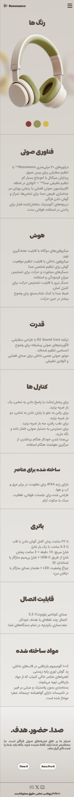
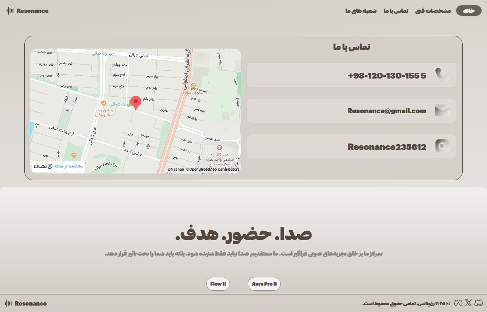
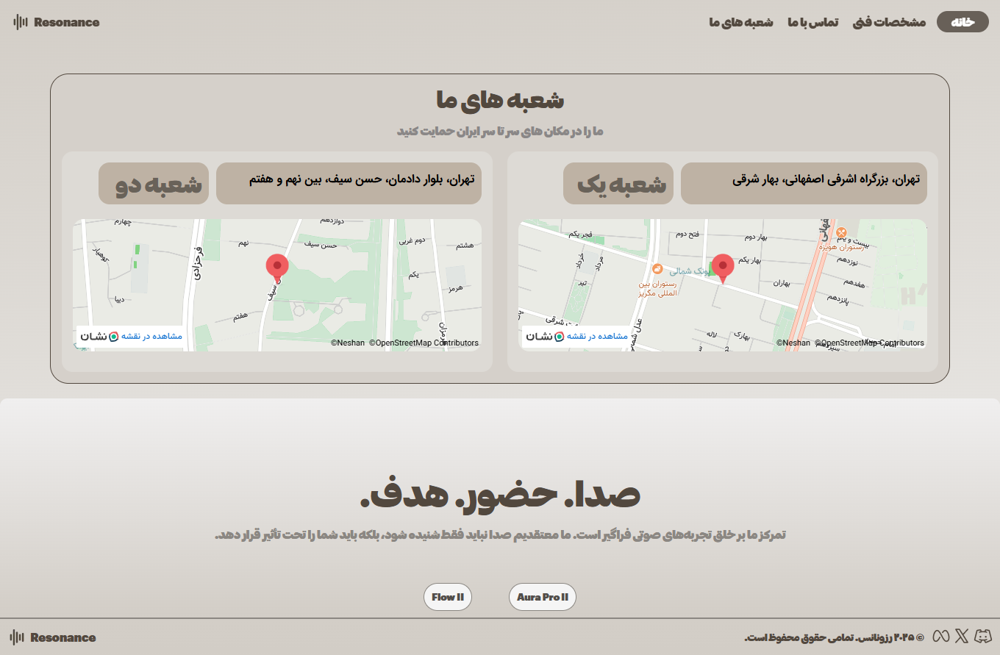

# Headphone Site

A modern and responsive product landing page designed for a headphone brand, with a focus on product presentation, clean UI, interactive elements, and responsive user experience.

## About the Project

Headphone Site is a product-focused landing page designed and developed to present a headphone brand and its product in a modern and engaging way.

The project includes dedicated sections for introducing the product, presenting technical specifications, highlighting product details, and providing a contact section.

The design was built with a strong focus on visual hierarchy, product presentation, responsive layouts, smooth animations, and interactive elements across different screen sizes.

## Key Features

* Modern and minimal product-focused design
* Fully responsive layout for desktop, tablet, and mobile
* Dedicated product presentation sections
* Technical specifications section
* Contact Us section
* Responsive mobile layouts
* Smooth CSS animations and transitions
* Interactive elements using JavaScript and jQuery
* Custom UI implementation without heavy frameworks
* Clean and lightweight front-end structure

## Technologies

* HTML5
* CSS3
* JavaScript
* jQuery

### CSS Features

* Flexbox
* CSS Grid
* CSS Animations
* Responsive Media Queries

## Screenshots

### Homepage — Desktop

### Homepage — Mobile

### Technical Specifications — Desktop

### Technical Specifications — Mobile

### Contact Us

### Additional Preview

---

# نسخه فارسی

## درباره پروژه

Headphone Site یک لندینگ‌پیج محصول برای معرفی یک برند و محصول هدفون است که با تمرکز بر ارائه حرفه‌ای محصول، طراحی رابط کاربری مدرن، تعاملات و تجربه کاربری ریسپانسیو طراحی و پیاده‌سازی شده است.

در این پروژه بخش‌های مختلفی برای معرفی محصول، نمایش مشخصات فنی، ارائه جزئیات محصول و ارتباط با کاربر در نظر گرفته شده است.

تمرکز اصلی در طراحی این پروژه روی ایجاد سلسله‌مراتب بصری مناسب، نمایش جذاب محصول، طراحی ریسپانسیو، انیمیشن‌های نرم و ایجاد تعاملات مناسب در اندازه‌های مختلف صفحه بوده است.

## ویژگی‌های کلیدی

* طراحی مدرن و مینیمال با تمرکز بر محصول
* کاملاً ریسپانسیو برای دسکتاپ، تبلت و موبایل
* دارای بخش‌های اختصاصی برای معرفی محصول
* بخش مشخصات فنی محصول
* بخش Contact Us
* طراحی اختصاصی برای نمایش در موبایل
* استفاده از انیمیشن‌ها و ترنزیشن‌های CSS
* ایجاد تعاملات با JavaScript و jQuery
* بدون وابستگی به فریم‌ورک‌های سنگین
* ساختار سبک و منظم در بخش فرانت‌اند

## تکنولوژی‌های استفاده‌شده

* HTML5
* CSS3
* JavaScript
* jQuery

### قابلیت‌های استفاده‌شده در CSS

* Flexbox
* CSS Grid
* CSS Animations
* Media Queries برای طراحی ریسپانسیو

## تصاویر پروژه

### صفحه اصلی — دسکتاپ

### صفحه اصلی — موبایل

### مشخصات فنی — دسکتاپ

### مشخصات فنی — موبایل

### تماس با ما

### پیش‌نمایش تکمیلی

## هدف از ساخت

هدف از ساخت این پروژه، تمرین و نمایش توانایی من در طراحی و توسعه یک صفحه معرفی محصول با استفاده از تکنولوژی‌های پایه فرانت‌اند بوده است.

در روند توسعه، تمرکز اصلی روی ایجاد یک رابط کاربری مدرن، نمایش مناسب محصول، طراحی ریسپانسیو، پیاده‌سازی تعاملات و انیمیشن‌ها و ایجاد ساختاری سبک و قابل استفاده بوده است.
